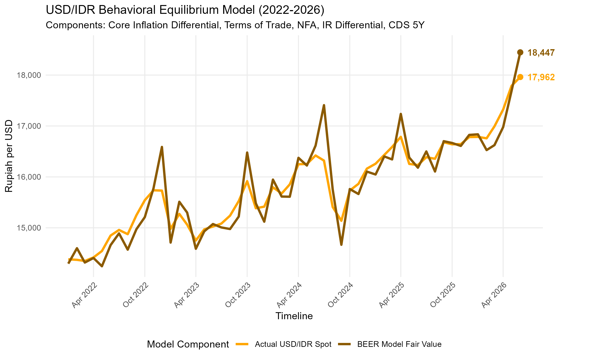
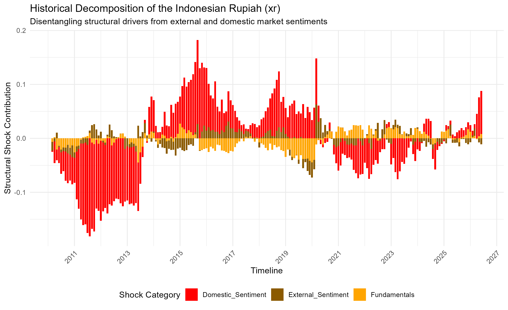
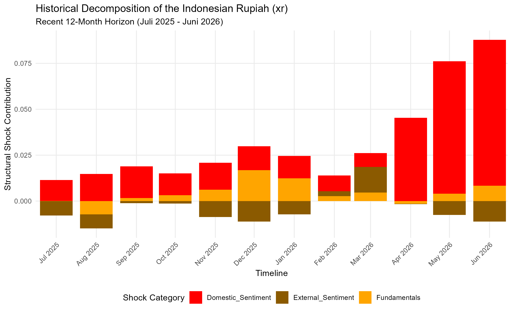

# Introduction

Assessing whether an exchange rate is aligned with economic fundamentals or driven by speculative and temporary shocks remains a core challenge in empirical macroeconomics. @ClarkMacDonald1998 formalized the Behavioral Equilibrium Exchange Rate (BEER) approach as an econometrically driven alternative to the Fundamental Equilibrium Exchange Rate (FEER) approach. While the FEER approach relies heavily on subjective definitions of internal and external balance, the BEER methodology utilizes cointegration techniques to establish direct behavioral linkages between the actual real or nominal exchange rate and its macroeconomic determinants.

The BEER approach is based on the idea that the actual real exchange rate can be explained exhaustively in terms of a set of fundamental variables, a set of variables that affect the exchange rate only in the short run, and a random error [@ClarkMacDonald1998]. Following @ClarkMacDonald1998, the reduced-form expression for the real exchange rate can be represented as:

$$
q_t = \beta_1'Z_{1t} + \beta_2'Z_{2t} + \tau'T_t + \epsilon_t
$$ {#eq-beer-general}

where $Z_1$ represents economic fundamentals expected to have persistent effects over the long run, $Z_2$ represents economic fundamentals affecting the real exchange rate over the medium term, $T$ represents transitory factors affecting the real exchange rate in the short run, and $\epsilon_t$ is a random disturbance term.

The current equilibrium rate, $q_t'$, is defined as the level of the exchange rate given by the current values of the economic fundamentals [@ClarkMacDonald1998]:

$$
q_t' = \beta_1'Z_{1t} + \beta_2'Z_{2t}
$$ {#eq-current-equilibrium}

Current misalignment, $cm_t$, is defined as the difference between the actual real exchange rate and the real exchange rate given by the current values of all economic fundamentals:

$$
cm_t = q_t - q_t' = \tau'T_t + \epsilon_t
$$ {#eq-current-misalignment}

Total misalignment, $tm_t$, is defined as the difference between the actual real rate and the real rate given by the sustainable or long-run values of the economic fundamentals, $\bar{Z}_{1t}$ and $\bar{Z}_{2t}$:

$$
tm_t = q_t - \beta_1'\bar{Z}_{1t} - \beta_2'\bar{Z}_{2t}
$$ {#eq-total-misalignment}

Following @ClarkMacDonald1998, total misalignment can be decomposed into current misalignment and the effect of departures of current fundamentals from their long-run values:

$$
tm_t = \tau'T_t + \epsilon_t + [\beta_1'(Z_{1t} - \bar{Z}_{1t}) + \beta_2'(Z_{2t} - \bar{Z}_{2t})]
$$ {#eq-misalignment-decomposition}

This framework is particularly well-suited for analyzing the Indonesian Rupiah, a currency that has experienced significant volatility and is influenced by both domestic macroeconomic conditions and external financial market sentiment.

The primary objective of this model is to separate the structural drivers of the currency into three distinct categories:

1. Fundamentals: Core macroeconomic variables that determine long-run sustainability, including the terms of trade, net foreign assets, inflation differentials, and interest rate differentials.
2. External Risk Sentiment: Global and sovereign risk factors measured through the 5-year Credit Default Swap (CDS) spread.
3. Domestic Market Sentiment: Idiosyncratic shocks and short-term currency innovations captured via the exchange rate residual itself.

# Theoretical Foundation

## The Risk-Adjusted Interest Parity Condition

The starting point of our model follows @ClarkMacDonald1998, beginning with the familiar risk-adjusted interest parity condition:

$$
E_t[\Delta s_{t+k}] = -(i_t - i_t^*) + \pi_t
$$ {#eq-risk-adjusted-interest-parity}

where $s_t$ is the foreign currency price of a unit of home currency, $i_t$ denotes a nominal interest rate, $\pi_t = \lambda_t + \kappa$ is the risk premium with a time-varying component $\lambda_t$, and $E_t$ is the conditional expectations operator.

Following @ClarkMacDonald1998, this can be converted into a real relationship by subtracting the expected inflation differential, yielding:

$$
q_t = E_t[q_{t+k}] + (r_t - r_t^*) - \pi_t
$$ {#eq-real-interest-parity}

where $r_t = i_t - E_t(\Delta p_{t+k})$ is the ex ante real interest rate. This equation describes the current equilibrium exchange rate as being determined by three components: the expectation of the real exchange rate in period $t+k$, the real interest differential, and the risk premium [@ClarkMacDonald1998].

## The Time-Varying Risk Premium

Following @ClarkMacDonald1998, the time-varying component of the risk premium term is assumed to be a function of the relative supply of domestic to foreign government debt:

$$
\lambda_t = g(gdebt_t / gdebt_t^*)
$$ {#eq-risk-premium-function}

An increase in the relative supply of outstanding domestic debt relative to foreign debt will increase the domestic risk premium, thereby requiring a depreciation of the current equilibrium real exchange rate [@ClarkMacDonald1998].

## Long-Run Equilibrium Fundamentals

The long-run equilibrium exchange rate, $\hat{q}_t$, is assumed to be a function of three fundamental variables [@ClarkMacDonald1998]:

$$
\hat{q}_t = f(tot_t, tnt_t, nfa_t)
$$ {#eq-long-run-fundamentals}

where:

- $tot$ is the terms of trade
- $tnt$ is the Balassa-Samuelson effect (relative price of nontraded to traded goods)
- $nfa$ is net foreign assets

The signs above the right-hand-side variables denote the partial derivatives, indicating the expected direction of influence on the equilibrium exchange rate [@ClarkMacDonald1998].

# Model Specification for the Indonesian Rupiah

## Variable Definitions and Data Sources

The model is estimated using monthly time-series data from January 2010 to May 2026. The vector of endogenous variables is denoted as:

$$
Y_t = \begin{bmatrix} tot_t & nfa_t & infl\_diff_t & ir\_diff_t & cds_t & xr_t \end{bmatrix}'
$$ {#eq-variable-vector}

Each variable is operationalized as follows:

### Exchange Rate ($xr_t$)

The natural logarithm of the nominal spot exchange rate (USD/IDR). An increase represents a depreciation of the Rupiah. This variable is measured as the monthly average of daily closing rates. *Source*: Bank Indonesia and Bloomberg.

### Inflation Differential ($infl\_diff_t$)

The core inflation differential between Indonesia and the United States:

$$
infl\_diff_t = Inflation_{IDN,t} - Inflation_{USA,t}
$$ {#eq-inflation-differential}

Core inflation is used to capture underlying price pressures, excluding volatile food and energy components. *Source*: Bank Indonesia and U.S. Bureau of Labor Statistics.

### Terms of Trade ($tot_t$)

The terms of trade index, reflecting the relative price of Indonesia's exports to imports. This is defined as:

$$
tot_t = \frac{Export\ Price\ Index_t}{Import\ Price\ Index_t}
$$ {#eq-terms-of-trade}

*Source*: Bank Indonesia, World Bank, and IMF International Financial Statistics.

### Net Foreign Assets ($nfa_t$)

The net external asset position of the economy, expressed as a ratio to GDP. This variable captures the stock equilibrium condition in the external sector. *Source*: Bank Indonesia and IMF International Investment Position statistics.

### Interest Rate Differential ($ir\_diff_t$)

The short-term interest rate differential between Indonesia and the United States:

$$
ir\_diff_t = Interest_{IDN,t} - Interest_{USA,t}
$$ {#eq-interest-differential}

This variable reflects the monetary policy stance and influences capital flows. Bank Indonesia and U.S. Federal Reserve are used to procure the policy rate.

### Credit Default Swap Spread ($cds_t$)

The 5-year Credit Default Swap spread for Indonesian sovereign bonds, serving as a proxy for external risk premium and international capital sentiment. Sourced from Bloomberg, This variable captures sovereign risk perceptions and global risk appetite.

## Theoretical Justification of the Variables

The choice of variables follows the theoretical framework established in @ClarkMacDonald1998 and subsequent BEER literature. The inclusion of the terms of trade and the Balassa-Samuelson effect (proxied by the inflation differential) captures the supply-side determinants of the real exchange rate [@ClarkMacDonald1998]. Net foreign assets captures the stock equilibrium condition and the external sustainability of the currency [@ClarkMacDonald1998; @Faruque1995].

The interest rate differential reflects the monetary policy stance and its influence on short-term capital flows [@ClarkMacDonald1998]. The inclusion of the CDS spread is motivated by the importance of sovereign risk perceptions for emerging market currencies [@Edwards1989; @Elbadawi1994]. This follows the empirical implementation of BEERs for developing countries, where external risk factors are critical determinants of exchange rate behavior [@Edwards1989; @Elbadawi1994].

# Econometric Methodology

## Lag Selection and Cointegration Analysis

The baseline model is derived from an unrestricted Vector Autoregressive (VAR) model of order $p$. Let $Y_t$ be a $K \times 1$ vector of endogenous variables ($K=6$). The $p$-lag VAR process with a constant vector is expressed as:

$$
Y_t = \mu + \sum_{i=1}^{p} A_i Y_{t-i} + u_t
$$ {#eq-var-general}

where $\mu$ is a $K \times 1$ vector of intercepts, $A_i$ are $K \times K$ coefficient matrices, and $u_t \sim i.i.d.\ N(0, \Sigma_u)$.

The optimal lag structure is determined by selecting $p=2$ based on standard information criteria (Akaike Information Criterion and Schwarz Bayesian Criterion). This follows the standard practice in the BEER literature of using a relatively small number of lags for annual or monthly data [@ClarkMacDonald1998; @MacDonald1995].

Following @Johansen1991 and @Johansen1995, if the elements of $Y_t$ are integrated of order one ($I(1)$), the system can be reparameterized into a Vector Error Correction Model (VECM):

$$
\Delta Y_t = \mu + \Pi Y_{t-1} + \sum_{i=1}^{p-1} \Gamma_i \Delta Y_{t-i} + u_t
$$ {#eq-vecm-general}

where $\Pi = \sum_{i=1}^{p} A_i - I_K$ and $\Gamma_i = -\sum_{j=i+1}^{p} A_j$. The matrix $\Pi$ captures the long-run relationships. Under a cointegration rank $r = 2$, $\Pi$ is factored as:

$$
\Pi = \alpha \beta'
$$ {#eq-pi-factorization}

where $\beta$ is a $K \times r$ matrix containing the long-run structural anchor vectors, and $\alpha$ is a $K \times r$ matrix representing the error correction adjustment speeds [@Johansen1995].

The Johansen trace test is used to determine the cointegration rank:

$$
TR = T\sum_{i=r+1}^{N} \ln(1 - \lambda_i)
$$ {#eq-trace-test}

where $\lambda_{r+1}, \dots, \lambda_N$ are the $N-r$ smallest squared canonical correlations between $x_{t-k}$ and $\Delta x_t$ series [@Johansen1995; @ClarkMacDonald1998].

## Cointegration Restrictions and Identification

Following @ClarkMacDonald1998, we impose identifying restrictions on the cointegrating space to facilitate economic interpretation. The long-run equilibrium relationship for the exchange rate is specified as:

$$
lq_t = \beta_1 ltot_t + \beta_2 ltnt_t + \beta_3 nfa_t + \beta_4 \lambda_t + \beta_0
$$ {#eq-cointegrating-vector1}

where $ltnt$ is proxied by the inflation differential. The second cointegrating vector captures the short-run effect of the interest rate differential:

$$
r_t - r_t^* = \gamma_0
$$ {#eq-cointegrating-vector2}

This identification scheme follows @ClarkMacDonald1998, who argued for a meaningful interpretation of multiple cointegrating vectors: one that embodies long-run determinants of the exchange rate and another that captures the short-run effect of interest rate differentials.

## Extraction of the BEER Fair Value {#sec-fair-value}

The VECM parameters are estimated using Maximum Likelihood (ML). The fundamental fair value of the currency is computed by isolating the long-term structural equilibrium from short-term error adjustments and transitory lag innovations. Let $xr_t$ be the actual log exchange rate. The log fair value $\widehat{xr}_t$ is extracted by subtracting the empirical VECM residuals from the observed series:

$$
\widehat{xr}_t = xr_t - \hat{u}_{xr, t}
$$ {#eq-fair-value-log}

where $\hat{u}_{xr, t}$ is the residual from the VECM equation for the exchange rate [@ClarkMacDonald1998].

To transform the modeled series back to the absolute currency level (Rupiah per USD), the exponential function is applied to the time series:

$$
\text{Actual IDR}_t = \exp(xr_t)
$$ {#eq-actual-level}

$$
\text{BEER Fair Value}_t = \exp(\widehat{xr}_t)
$$ {#eq-fair-value-level}

This transformation ensures that the fair value is expressed in the same units as the actual exchange rate, facilitating economic interpretation and policy analysis.

## Diagnostic Testing

Following @ClarkMacDonald1998, we conduct a battery of diagnostic tests to ensure the adequacy of the estimated model. These include:

### Multivariate Stationarity Tests

Following @Johansen1995, the null hypothesis of stationarity against the alternative of non-stationarity is tested, subject to the chosen cointegration rank.

### Residual Diagnostics

Multivariate tests for serial correlation (Ljung-Box and LM tests) and normality (Doornik-Hansen test) are conducted. These tests ensure that the estimated residuals are white noise, which is consistent with the interpretation of measured misalignment as reflecting transitory and random factors [@ClarkMacDonald1998].

### Alpha Adjustment Matrix

The $\alpha$ matrix is interpreted as the adjustment matrix, indicating the speed with which the system responds to last period's deviation from the equilibrium level of the exchange rate [@Johansen1995; @ClarkMacDonald1998].

# Structural VAR and Shock Identification

## The SVAR Framework

To disentangle the dynamic impacts of global, domestic, and fundamental components, the VAR model is restricted using a structural framework. The structural relationship between reduced-form innovations $u_t$ and orthogonal structural shocks $\varepsilon_t$ is defined via the contemporary matrix $B_0$:

$$
B_0 u_t = \varepsilon_t \quad \implies \quad u_t = B_0^{-1} \varepsilon_t
$$ {#eq-svar-relationship}

where $E[\varepsilon_t \varepsilon_t'] = I_K$. This implies that the variance-covariance matrix satisfies:

$$
\Sigma_u = B_0^{-1} (B_0^{-1})'
$$ {#eq-sigma-relationship}

Following @Sims1980, identification is achieved using a lower-triangular Cholesky decomposition of $\Sigma_u$, such that $B_0^{-1}$ is uniquely obtained via the lower Cholesky factor:

$$
B_0^{-1} = \text{chol}(\Sigma_u)'
$$ {#eq-cholesky}

## Causal Ordering and Structural Assumptions

The structural identification relies on a recursive exclusion restriction scheme. Variables ordered earlier are assumed to exert an immediate, contemporaneous effect on subsequent variables but react to subsequent variables only with a lag. The variables are ordered as follows:

$$
\text{Ordering: } tot_t \longrightarrow nfa_t \longrightarrow infl\_diff_t \longrightarrow ir\_diff_t \longrightarrow cds_t \longrightarrow xr_t
$$ {#eq-ordering}

The underlying structural assumptions justifying this sequence are:

1. Terms of Trade ($tot$): Determined primarily by global commodity prices, rendering it completely exogenous to domestic Indonesian macroeconomic fluctuations in the short run. This follows the standard assumption in the BEER literature for commodity-exporting countries [@Edwards1989; @Elbadawi1994].

2. Net Foreign Assets ($nfa$): Responds contemporaneously to trade balance shifts ($tot$), but capital position changes take time to influence domestic price indices. This is consistent with the stock-flow equilibrium approach to exchange rate modeling [@Faruque1995; @ClarkMacDonald1998].

3. Inflation Differential ($infl\_diff$): Reacts directly to real trade and external balance flows, but central bank policy rates adjust with a minor lag. The inflation differential captures the Balassa-Samuelson effect, which relates to the relative price of nontraded to traded goods [@ClarkMacDonald1998].

4. Interest Rate Differential ($ir\_diff$): Represents the monetary policy stance, reacting instantly to domestic inflation pressures and external shocks. This follows the monetary policy reaction function literature [@Taylor1993].

5. Credit Default Swap ($cds$): Captures sovereign premium adjustments influenced by domestic macro stability indicators ($tot, nfa, infl, ir$), acting as a fast-moving gauge of external financial risk sentiment. This is consistent with the literature on sovereign risk and exchange rates [@Edwards1989].

6. Exchange Rate ($xr$): Being a highly liquid asset market price, it adjusts instantaneously to every structural innovation in the system, absorbing all prior structural fundamentals and sentiment shocks. This reflects the efficient markets hypothesis for exchange rates [@ClarkMacDonald1998].

## Historical Decomposition

To analyze how specific categories of shocks shaped the sample history, the structural innovations are propagated through the Vector Moving Average (VMA) representation:

$$
Y_t = \sum_{s=0}^{\infty} \Phi_s \mu + \sum_{s=0}^{\infty} \Theta_s \varepsilon_{t-s}
$$ {#eq-vma-representation}

where the moving average matrices $\Phi_s$ are updated recursively via:

$$
\Phi_s = \sum_{i=1}^{p} \Phi_{s-i} A_i
$$ {#eq-phi-recursion}

with $\Phi_0 = I_K$, and the structural impulse response matrices are given by:

$$
\Theta_s = \Phi_s B_0^{-1}
$$ {#eq-theta-definition}

The historical contribution of a specific shock $j$ to variable $i$ at time $t$ is calculated as:

$$
H_{i,j,t} = \sum_{s=0}^{t-1} \theta_{ij, s} \varepsilon_{j, t-s}
$$ {#eq-historical-contribution}

This decomposition allows us to attribute movements in the exchange rate to specific structural shocks, distinguishing between fundamental factors, external risk sentiment, and domestic currency market sentiment.

# Structural Classification for Policy Analysis

Following the mathematical computation of the historical shock matrices, individual variable contributions are aggregated into three clear, structural dimensions to identify whether the Rupiah is driven by core macroeconomic fundamentals, country-risk considerations, or short-term noise:

$$
\text{Fundamentals}_t = H_{xr,tot,t} + H_{xr,nfa,t} + H_{xr,infl\_diff,t} + H_{xr,ir\_diff,t}
$$ {#eq-fundamentals}

$$
\text{External Sentiment}_t = H_{xr,cds,t}
$$ {#eq-external-sentiment}

$$
\text{Domestic Sentiment}_t = H_{xr,xr,t}
$$ {#eq-domestic-sentiment}

Because an increase in $xr$ means a depreciation of the Rupiah against the USD, a positive structural contribution in any category signifies that the specific shock cluster is exerting depreciation pressure on the currency, while negative values reflect appreciation drivers.

This classification scheme follows the policy-oriented interpretation of BEERs developed by @ClarkMacDonald1998, who emphasized the importance of distinguishing between misalignment arising from transitory factors, random disturbances, and departures of economic fundamentals from their sustainable values.

# Results

## Actual Exchange Rate versus BEER Fair Value

@fig-fair-value plots the actual USD/IDR spot rate against the BEER fair value implied by @eq-fair-value-level over January 2022 to June 2026. The x-axis is the monthly timeline and the y-axis is the exchange rate in Rupiah per USD, so an upward movement represents a depreciation of the Rupiah. The actual spot rate is the monthly average of daily closing rates (Bank Indonesia and Bloomberg), while the fair value is the authors' calculation from the VECM estimates described in @sec-fair-value.

{#fig-fair-value}

The fair value tracks the actual rate closely over most of the window, with the actual rate oscillating around the model-implied equilibrium. This behavior is consistent with the error-correction interpretation of the cointegrating relationship. Episodes where the fair value spikes above the actual rate (late 2022, late 2023, mid-2024, and April 2025) correspond to periods in which fundamentals and risk pricing deteriorated faster than the spot rate adjusted. At the end of the sample (June 2026), the actual rate stands at Rp17,962 per USD against a fair value of Rp18,447, implying that the Rupiah trades approximately 2.6 percent stronger than the level consistent with current fundamentals.

The strong caveat must be reserved for the last two most recent observations (May and June 2026), however. Several fundamentals in $Z_t$ like notably the terms of trade and net foreign assets are published with a lag and is not available yet for May and June 2026 as the time of writing. The latest available readings are carried forward for these months. These estimates are therefore subject to revision as soon as the underlying data become available.

## Historical Decomposition: Full Sample

@fig-hd-full presents the historical decomposition of the exchange rate based on @eq-fundamentals through @eq-domestic-sentiment. The x-axis is the monthly timeline from March 2010 to June 2026 and the y-axis is the cumulative structural shock contribution to the log exchange rate, in log deviations from the deterministic baseline; because $xr$ is in logarithms, a value of 0.05 corresponds roughly to 5 percent of depreciation pressure. Positive bars indicate depreciation pressure on the Rupiah and negative bars indicate appreciation pressure. The bars stack the three shock groups: fundamentals (orange), external sentiment (dark brown), and domestic sentiment (red). Source: authors' calculations from the SVAR.

{#fig-hd-full}

Three features stand out. First, domestic sentiment shocks dominate the amplitude of the decomposition throughout the sample: the large appreciation pressure of 2011--2013, the depreciation episodes of 2015--2016 and 2018--2019, and the renewed appreciation pressure of 2021--2023 are all predominantly attributable to the domestic sentiment component. Second, external sentiment contributes episodically rather than continuously. Its largest imprints coincide with well-identified global risk events, including the 2013 taper tantrum, the COVID-19 shock in early 2020, and again in early 2026. Third, fundamentals deliver comparatively modest but persistent contributions, providing appreciation support during 2019--2020 and mild depreciation pressure from 2023 onward. The sample ends with a sharp build-up of depreciation pressure, again led by domestic sentiment.

## Historical Decomposition: Recent Twelve Months

@fig-hd-12m zooms the same decomposition into the most recent twelve months, July 2025 to June 2026. The axes and shock groupings are identical to @fig-hd-full; only the window differs.

{#fig-hd-12m}

Depreciation pressure builds steadily over the window. Through late 2025 the total contribution is modest (below 0.03) and its composition is mixed: fundamentals account for a sizeable share in December 2025 and January 2026, while external sentiment is mostly a small offsetting (appreciation) factor. 

The composition shifts markedly in the final quarter. In March 2026, external sentiment posts its largest positive contribution of the window, but from April to June 2026 the acceleration is driven almost entirely by domestic sentiment, whose contribution rises to roughly 0.08 by June 2026 while fundamentals remain small and external sentiment turns negative. 

The recent weakening of the Rupiah therefore reflects domestic currency-market sentiment rather than a deterioration in fundamentals, which is the same conclusion suggested by the fair-value gap in @fig-fair-value. As with the fair value, the decomposition for May and June 2026 rests on fundamentals data that are carried forward pending release, and both months will be updated once the underlying data become available.

# Interpretation and Policy Implications

## The BEER Framework for Exchange Rate Assessment

The BEER approach provides a systematic way to assess whether a country's exchange rate is consistent with economic fundamentals [@ClarkMacDonald1998]. The estimated BEER can be interpreted as the level of the exchange rate that is consistent with the current values of the economic fundamentals. A departure of the actual exchange rate from the BEER suggests misalignment, which may be unsustainable in the long run [@ClarkMacDonald1998].

As noted by @ClarkMacDonald1998:

> "The methodology of the BEER... implies that a departure of the actual real exchange rate from the estimated BEER will not be sustainable, as the cointegrating vector of variables operates as an attractor that eventually brings the actual exchange rate back into line with the value consistent with the fundamentals."

## Policy Relevance

The model has several important policy applications:

1. Exchange Rate Surveillance: The BEER provides a benchmark for assessing whether the Rupiah is overvalued or undervalued relative to fundamentals, supporting the conduct of exchange rate policy.

2. Identification of External Shocks: The historical decomposition distinguishes between shocks originating from global commodity prices, sovereign risk perceptions, and domestic factors, helping policymakers understand the drivers of exchange rate movements.

3. Capital Flow Management: The separate identification of external sentiment (proxied by the CDS spread) allows policymakers to assess the impact of global financial conditions on the Rupiah and design appropriate policy responses.

4. Monetary Policy Transmission: The interest rate differential variable captures the monetary policy transmission mechanism to the exchange rate, providing insights into the effectiveness of monetary policy in stabilizing the currency.

## Limitations and Future Research

While the BEER approach offers significant advantages for exchange rate assessment, several limitations should be acknowledged [@ClarkMacDonald1998]:

1. Model Specification: The BEER approach does not directly incorporate considerations of internal and external balance, which are central to the FEER approach. Future research could calibrate the fundamentals at values corresponding to full employment and sustainable current account positions.

2. Identification of Fundamentals: The distinction between transitory and permanent components of the fundamentals requires judgment, and the use of smoothing procedures such as the Hodrick-Prescott filter is mechanical and may not correspond to economic notions of sustainable levels.

3. Emerging Market Specificities: While the model incorporates sovereign risk through the CDS spread, other factors specific to emerging markets (such as financial dollarization, capital account restrictions, and institutional quality) could be incorporated in future extensions.

4. Forecasting Performance: Future research could evaluate the out-of-sample forecasting performance of the model, following the approach of @MacDonald1997a and @MacDonaldMarsh1997, who demonstrated that BEER-type models have good forecasting properties relative to a martingale process.

# Appendix: Mathematical Derivations and Code Implementation {.appendix}

## Johansen Cointegration Framework

The Johansen procedure for cointegration analysis involves the following steps:

Step 1: Specify the VAR model of order $p$:

$$
Y_t = \mu + \sum_{i=1}^{p} A_i Y_{t-i} + u_t
$$

Step 2: Reparameterize into VECM form:

$$
\Delta Y_t = \mu + \Pi Y_{t-1} + \sum_{i=1}^{p-1} \Gamma_i \Delta Y_{t-i} + u_t
$$

Step 3: Compute the likelihood ratio test for the rank of $\Pi$:

$$
TR = T\sum_{i=r+1}^{N} \ln(1 - \lambda_i)
$$

Step 4: Impose identifying restrictions on $\beta$ and $\alpha$ matrices.

## SVAR Identification

The Cholesky decomposition follows these steps:

Step 1: Estimate the reduced-form VAR and obtain $\Sigma_u$.

Step 2: Compute the Cholesky decomposition:

$$
\Sigma_u = PP'
$$

where $P$ is lower triangular.

Step 3: Set $B_0^{-1} = P$ and $B_0 = P^{-1}$.

Step 4: Compute structural innovations:

$$
\varepsilon_t = B_0 u_t = P^{-1} u_t
$$

## Historical Decomposition

The historical decomposition algorithm proceeds as follows:

Step 1: Compute the moving average coefficient matrices:

$$
\Phi_s = \sum_{i=1}^{p} \Phi_{s-i} A_i, \quad \Phi_0 = I_K
$$

Step 2: Compute structural impulse responses:

$$
\Theta_s = \Phi_s B_0^{-1}
$$

Step 3: For each time $t$ and shock $j$:

$$
H_{i,j,t} = \sum_{s=0}^{t-1} \theta_{ij,s} \varepsilon_{j,t-s}
$$

## Variable Definitions Summary

@tbl-variables summarizes the definition and data source of each variable in the endogenous vector $Y_t$.

| Variable | Definition | Source |
|--------------|----------------------------------------|--------------------------------|
| $xr_t$ | Natural log of USD/IDR nominal exchange rate | Bank Indonesia, Bloomberg |
| $infl\_diff_t$ | Core inflation differential (Indonesia - USA) | Bank Indonesia, BLS |
| $tot_t$ | Terms of trade (export/import price ratio) | Bank Indonesia, World Bank, IMF IFS |
| $nfa_t$ | Net foreign assets / GDP | Bank Indonesia, IMF IIP |
| $ir\_diff_t$ | Short-term interest rate differential | Bank Indonesia, U.S. Federal Reserve |
| $cds_t$ | 5-year sovereign CDS spread | Bloomberg |

: Variable Definitions and Data Sources {#tbl-variables}

# Reproducibility Statement {.unnumbered}

The model replication package is hosted in the [DEN public GitHub repository](https://www.github.com/den-econ/beer/).

# References {.unnumbered}